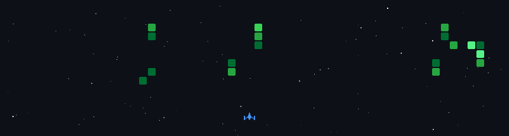

<h1 align="center">Yeshwanth Atmakuri</h1>

  <b>AI Systems Engineer | Agentic AI & Multi-Agent Architect</b>

  

---

## 🧠 About Me

Exploring the boundary between autonomous machine intelligence and core software architectures. Currently engineering production-grade Retrieval-Augmented Generation (RAG) ecosystems, real-time voice intelligence, and scalable AI infrastructure. 

* 🛠️ Juggling **multi-agent race conditions**, optimizing **vector storage retrieval**, and debugging runtime environments at **2 AM**.
* 🧪 **Core Focus:** Advanced Agentic AI frameworks (LangGraph, CrewAI), Model Context Protocol (MCP), and real-time audio streaming infrastructure.
* 🔬 **Research & Collaboration:** Associate at **Next Tech Lab**, collaborating on deep learning pipelines and autonomous intelligence architectures.

---

## 🛠️ Tech Stack

### 🤖 Generative AI & Agentic Frameworks

  
  
  
  
  

### 💻 Core Languages & Backend

  
  
  
  

### 🗄️ Databases, Vector Stores & Streaming

  
  
  
  

### ☁️ MLOps & Infrastructure

  
  
  
  

---

## 🚀 Featured AI Production Systems

### 🎙️ Simmy AI | *Core Contributor*
> **Dockerized Voice AI Platform** engineered for ultra-low latency, production-ready real-time interaction.
* Implemented a cutting-edge **LightRAG** architecture for lightning-fast graph-based content retrieval.
* Leveraged **LiveKit** audio streaming and **FastAPI** to build high-performance audio inference pipelines.
* Fully containerized with **Docker** and deployed across **AWS EC2/S3** infrastructure.

### 🤖 Nexi | *RAG Voice Agent Architecture*
> **Context-Aware Voice Intelligence System** built to optimize institutional query handling.
* Designed a **dual-RAG routing pipeline** that dynamically switches between unstructured PDFs and structured JSON sources depending on intent classification.
* Implemented complex session persistence mechanics enabling full conversation memory and graceful reconnection handling.
* **Stack:** Python, LangChain, Qdrant Vector DB, LiveKit STT/TTS.

### 🏛️ Culture Agent | *Smart India Hackathon (SIH) Qualifier*
> **Domain-Bounded RAG Engine** built for AR-based cultural heritage reconstruction.
* Built a strictly bounded, domain-specific RAG pipeline to power immersive, factual contextual lookups in 3D historical environments.
* Handled context-injection barriers to avoid LLM hallucinations regarding historical facts.

---

## 📊 GitHub Analytics

  

  
  

  

## 👾 GitHub Space Shooter

  

---

## 🎯 What I Focus On

* Multi-Agent Orchestration & Graph-Based Executions (LangGraph, CrewAI)
* Advanced Retrieval Engineering (GraphRAG, Hybrid Search, Dense/Sparse Routing)
* Real-time Streaming Infrastructures & Voice-to-Voice AI Engines
* Hardware-Software Co-Design & High-Performance Data Structures

---

## 🤝 Connect & Collaborate

  

  

⚡ *Constantly evolving architectures to align autonomous agents with industrial scalability.*
