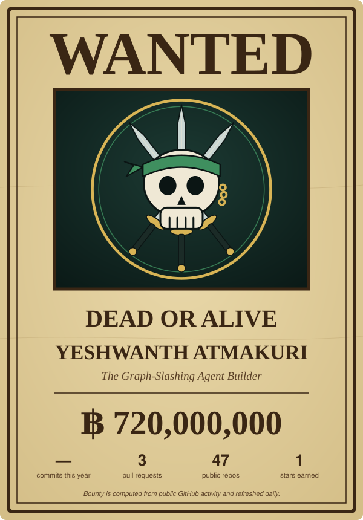
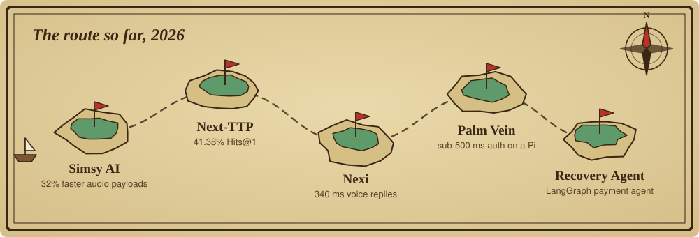

<picture>
  <source media="(prefers-color-scheme: dark)" srcset="assets/banner-dark.svg">
  <source media="(prefers-color-scheme: light)" srcset="assets/banner-light.svg">
  
</picture>

  <a href="https://yesh-eosin.vercel.app/"><b>Portfolio</b></a> &nbsp;|&nbsp;
  <a href="https://www.linkedin.com/in/yesh26/"><b>LinkedIn</b></a> &nbsp;|&nbsp;
  <a href="mailto:atmakuriyeshwanth@gmail.com"><b>Email</b></a>

<table>
<tr>
<td width="340" valign="top">

</td>
<td valign="top">

### Hi, I'm Yeshwanth

I'm a B.Tech CSE (AI & ML) student at SRM University AP (CGPA 9.20) who builds retrieval systems, real-time voice agents, and autonomous workflows. I've shipped voice AI components for a production platform as an intern and I'm currently an AI Automation R&D Intern at Advfiction.

My research work turns unstructured cyber threat reports into knowledge graphs and predicts an attacker's next technique with a RotatE embedding model.

**Now:** workflow automation for a multi-sector Business OS (CRM, ERP, AI services).
**Community:** Member, McCarthy Lab, Next Tech Lab, my college's mentorship club.

*The bounty on the poster is a fun score computed from my public GitHub activity. It refreshes daily.*

</td>
</tr>
</table>

## Three-Sword Style

I work in three areas and try to keep each one sharp.

| Retrieval and graphs | Real-time voice AI | Agents and automation |
|---|---|---|
| Built a **GraphRAG** threat-intelligence framework (ChromaDB, SentenceTransformers, Neo4j) that maps reports to MITRE ATT&CK graphs | Deployed voice pipeline components on **FastAPI, Docker, LightRAG and LiveKit** for Simsy AI | Built an autonomous **LangGraph** agent that diagnoses failed payments and sends personalised retry links |
| Tuned a **RotatE** model in PyTorch to **41.38% Hits@1**, over 10x better than GNN, LLM and Markov baselines | Cut audio payload latency by **32%** and container baseline storage by **45%** | Designed event-driven automation across webhooks, retries and error handling; compared n8n, Zoho Flow, Zapier and Workato |

## Voyage log

| When | Where | What I did |
|---|---|---|
| Aug 2026 to now | **Advfiction**, AI Automation R&D Intern | Designing automation workflows for a Business OS that connects CRM, ERP, AI and external services |
| May to Jul 2026 | **SRM University AP**, Research Intern | Architected the GraphRAG threat-intelligence framework and the RotatE next-technique predictor |
| Mar to Aug 2026 | **Universiti Teknologi Malaysia**, exchange semester | Semester exchange program in Johor Bahru |
| Jan to Mar 2026 | **Simsy AI**, AI Engineering Intern | Shipped production voice AI pipeline components; improved concurrency and cut storage by 45% |

**Smart India Hackathon:** twice an internal qualifier (2025 and 2026), selected among the top 45 of 300+ team entries. I led teams on an AR cultural-heritage assistant with a domain-bounded RAG pipeline (2025) and a satellite imagery change-detection engine (2026).

## The route so far

| Project | What it does | Built with |
|---|---|---|
| [**Next-TTP-Prediction**](https://github.com/YEsh-DEV/Next-TTP-Prediction) | Temporal-causal GraphRAG that predicts an attacker group's next technique from actor-aware knowledge graphs. **41.38% Hits@1.** | Python, PyTorch, Neo4j, ChromaDB, PyKEEN |
| [**Nexi**](https://github.com/YEsh-DEV/nexi-ntl) | Campus voice assistant that routes each question to PDFs or structured data. **340 ms** replies, **98.4%** grounded accuracy. | Python, LlamaIndex, ChromaDB, LiveKit, Gemini |
| [**Palm Vein Payments**](https://github.com/YEsh-DEV/vein-detection) | Edge biometric payment authentication on a Raspberry Pi 5 using near-infrared imaging. **Sub-500 ms** auth, **FAR below 0.1%**. | Python, MediaPipe, OpenCV, FastAPI, React, SQLite |
| [**Autonomous Recovery Agent**](https://github.com/YEsh-DEV/Autonomous-Recovery-Agent) | Agent that classifies why a payment failed and dispatches a retry link. Drops in as webhook middleware. | Python, LangGraph, FastAPI, SQLite |
| **Simsy AI voice platform** | Production voice AI work from my internship (private company code). | FastAPI, Docker, LightRAG, LiveKit, AWS |

## Armory

| | |
|---|---|
| **Languages** | `Python` `C++` `Java` `JavaScript` |
| **AI and ML** | `PyTorch` `TensorFlow` `scikit-learn` `XGBoost` `PyKEEN` `NetworkX` |
| **Generative AI** | `LangChain` `LangGraph` `CrewAI` `LlamaIndex` `RAG` `GraphRAG` `LightRAG` |
| **Backend and real-time** | `FastAPI` `REST APIs` `SQLAlchemy` `LiveKit` `Docker` |
| **Data stores** | `Neo4j` `Qdrant` `ChromaDB` `PostgreSQL` `SQLite` |
| **Cloud and tools** | `AWS EC2` `AWS S3` `Git` `React` `Jupyter` `OpenCV` `MediaPipe` |

## Logbook

The latest entries from my public repositories, written by a GitHub Action.

<!-- LOGBOOK:START -->
| Date | Repo | Entry |
|---|---|---|
| 2026-10-01 | [Vectorless-Rag](https://github.com/YEsh-DEV/Vectorless-Rag) | pushed new commits |
| 2026-10-02 | [Vectorless-Rag](https://github.com/YEsh-DEV/Vectorless-Rag) | pushed new commits |
| 2026-09-29 | [Lunar-Matching](https://github.com/YEsh-DEV/Lunar-Matching) | pushed new commits |
| 2026-09-24 | [vein-detection](https://github.com/YEsh-DEV/vein-detection) | pushed new commits |
| 2026-09-25 | [vein-detection](https://github.com/YEsh-DEV/vein-detection) | pushed new commits |
<!-- LOGBOOK:END -->

  Open to internships, research collaborations and interesting problems. 
  <a href="https://yesh-eosin.vercel.app/"><b>Portfolio</b></a> &nbsp;|&nbsp;
  <a href="https://www.linkedin.com/in/yesh26/"><b>LinkedIn</b></a> &nbsp;|&nbsp;
  <a href="mailto:atmakuriyeshwanth@gmail.com"><b>Email</b></a>

Directions are optional. Shipping is not.

